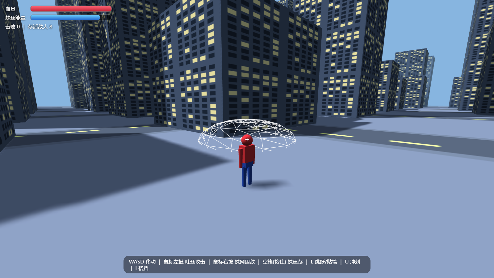

# 蜘蛛侠：城市之战 (Spider-Man: City Battle)

一个**单 HTML 文件**的 3D 蜘蛛侠小游戏，基于 [Three.js](https://threejs.org/)（CDN 加载）。
场景中所有模型——蜘蛛侠、怪物、城市楼房——全部由**程序几何体拼装**，不加载任何外部 GLB/模型/音频文件。



## 运行方式

直接双击打开 `index.html` 即可游玩（需联网加载 Three.js CDN）。
也可以用任意静态服务器启动，例如：

```bash
python -m http.server 8000
# 浏览器访问 http://localhost:8000/index.html
```

## 操作说明

| 按键 | 功能 |
|---|---|
| `W A S D` | 移动（相机系相对方向） |
| 鼠标移动 | 转动第三人称视角（点击画面锁定指针） |
| 鼠标左键 | 吐丝攻击（命中怪物扣血，耗能 6） |
| 鼠标右键 | 发射蛛网，落地生成蛛网区域困住敌人（耗能 20） |
| `空格`（按住） | 蛛丝荡摆：自动钩住附近高楼，绳索物理荡秋千；W 收线 / S 放线；**松开空格立即断丝** |
| `L` | 跳跃；空中碰墙时按下 = 飞檐走壁（W/S 上下爬、A/D 横移、到顶自动翻上楼顶、再按 L 蹬墙跳） |
| `U` | 冲刺（耗能 12） |
| `I` | 格挡（按住，减免 75% 伤害） |
| `J` / `K` / `O` | 备用键：攻击 / 荡丝 / 蛛网 |

## 游戏机制

- **蛛丝能量**：荡摆、爬墙、技能都会消耗能量；静止站立时快速恢复。
- **血量**：被怪物近身攻击扣血，格挡可大幅减免；血量归零后 3 秒重生。
- **敌人 AI**：8 只六腿蜘蛛怪在城市巡逻，26 米内发现玩家后追击并近身攻击；
  被蛛网困住会暂停行动，被吐丝击中会激怒并扣血，死亡后自动重生。
- **碰撞检测**：楼房 AABB 碰撞（可跳上/荡上楼顶站立）、地面与楼顶支撑、
  墙面法线判定（用于贴墙攀爬）、相机防穿墙、弹道命中检测。

## 代码结构

全部代码在 `index.html` 一个文件内，按注释划分为 12 个模块：

1. 基础场景（渲染器 / 光照 / 雾）
2. 城市生成（程序几何体：楼房 / 街道 / 地面）
3. 碰撞检测（楼房 AABB / 地面 / 墙面判断）
4. 玩家模型（纯几何体拼装蜘蛛侠）
5. 输入系统（键鼠绑定）
6. 玩家移动物理（跑动 / 跳跃 / 冲刺）
7. 蛛丝物理（荡摆绳索约束 / 吐丝 / 蛛网）
8. 飞檐走壁（贴墙攀爬）
9. 敌人 AI（巡逻 / 追击 / 攻击 / 被网困）
10. 第三人称相机
11. HUD 与音效（WebAudio 程序生成）
12. 主循环

## 技术要点

- **Three.js r147**（UMD 版，CDN 双源兜底）
- 蛛丝荡摆：半隐式欧拉积分 + 球面距离约束（超出绳长则拉回并消除径向速度）
- 楼房碰撞：圆形玩家碰撞体 vs AABB 的最近点推出
- 贴墙判定：碰撞返回的墙面法线 + 前向探测点查询楼体
- 窗户/街道贴图：Canvas 程序生成纹理
- 音效：WebAudio 振荡器程序合成，无外部音频
